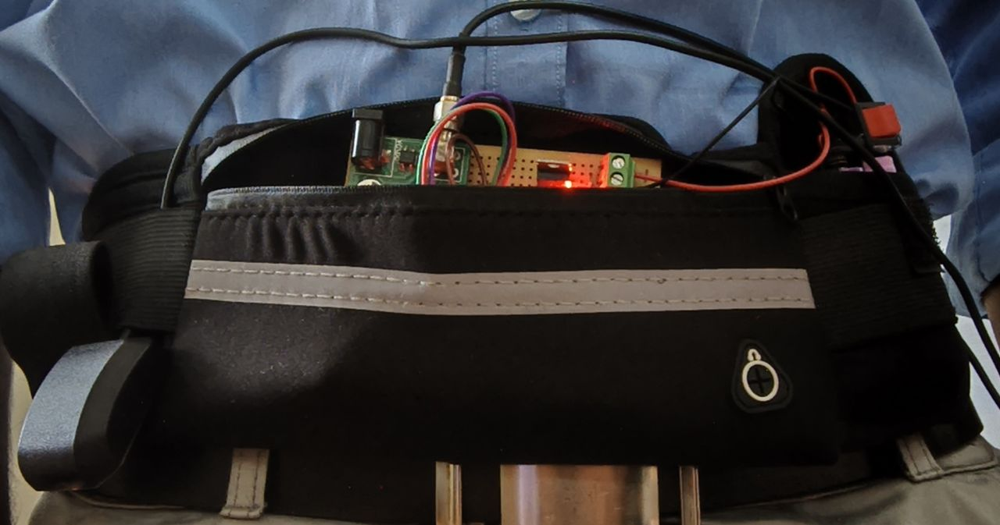

# 🩺 Elder Fall Detection System

A smart IoT-based wearable system designed to monitor elderly individuals, detect falls in real time, and provide live location tracking. The system uses motion data from an accelerometer and automatically updates a cloud database, enabling caregivers to monitor the user's status through a mobile application.

## 🚀 Features

* 📡 Real-time monitoring using ESP32
* 🏃 Activity detection (SAFE / ACTIVE / FALL)
* 🚨 Instant fall detection and alert generation
* 📍 Live GPS location tracking
* ☁️ Firebase Realtime Database integration
* 📱 Flutter-based mobile application
* 📊 Event logging and sensor data visualization
* 🔄 Continuous cloud synchronization

## 🛠️ Tech Stack

### Hardware

* ESP32
* MPU6050 Accelerometer & Gyroscope
* GPS Module

### Software

* Flutter
* Firebase Realtime Database
* Arduino IDE

## 🏗️ System Architecture

```text
MPU6050 + GPS
       │
       ▼
     ESP32
       │
       ▼
Firebase Realtime Database
       │
       ▼
 Flutter Mobile App
       │
       ▼
 Caregiver / User Monitoring
```

## ⚙️ Working Principle

1. The MPU6050 continuously measures acceleration and motion data.
2. ESP32 processes sensor readings to determine the user's state:

   * ✅ SAFE
   * 🚶 ACTIVE
   * 🚨 FALL
3. GPS coordinates are collected in real time.
4. Sensor status and location data are uploaded to Firebase.
5. The Flutter application retrieves and displays:

   * Current status
   * Live location
   * Historical event logs
6. When a fall is detected, an alert is immediately generated.

## 📱 Application Screenshots

<p align="center">
  
  
  
</p>

## Hardware Prototype

<p align="center">
  
</p>

## 👨‍💻 Team

<table align="center">
<tr>
<td align="center">

### Kirubagaran A
[](https://github.com/KIRUBA-110)

</td>

<td align="center">

### Guna Chandru
[](https://github.com/gchan57)

</td>

<td align="center">

### Jeevith K S
[](https://github.com/jeevithks08)

</td>
</tr>
</table>


